<div align="center">

# 🧠 AI Memory Cognitive Platform

### Memória compartilhada, observabilidade cognitiva e continuidade real entre agentes de IA

**Troque de GPT para Claude, Gemini, Cursor ou Grok sem perder o contexto do trabalho.**  
O agente executa. **A memória pertence ao projeto.**


</div>

---

## Visão geral

O **AI Memory Cognitive Platform** adiciona uma camada visual, operacional e multiagente ao [`ai-memory`](https://github.com/akitaonrails/ai-memory), mantendo o princípio mais importante do projeto original:

> **memória durável não deve pertencer a um único agente ou provedor.**

A solução é dividida em **dois projetos independentes**:

| Projeto | Responsabilidade |
|---|---|
| **AI Memory Backend API** | Core de memória em Rust, Cognitive API em Node.js, PostgreSQL read-model, chat multiagente, agentes, MCPs, credenciais, sincronização e observabilidade |
| **AI Memory Frontend App** | Cognitive Console em React com Neural Brain, Memory Health, agentes, MCPs, handoffs, Time Travel, Explain Search e chat persistente |

O backend preserva o **core original em Rust** como fonte de verdade da memória. O PostgreSQL não substitui o Core: ele funciona como um **read-model cognitivo especializado** para visualização, métricas, histórico, proveniência, busca explicável e configuração operacional.

---

# ✨ O que a plataforma resolve

### Antes

```text
Claude tem sua memória
GPT tem outra memória
Cursor tem outro contexto
Gemini começa do zero
Grok não sabe o que aconteceu

Trocar de agente = reexplicar o projeto.
```

### Com AI Memory

```text
                   ┌──────────────────────┐
                   │   SHARED AI MEMORY   │
                   │  conhecimento comum  │
                   └──────────┬───────────┘
          ┌───────────────────┼───────────────────┐
          │                   │                   │
        GPT                 Claude             Gemini
          │                   │                   │
          ├──────── Cursor ────┼──── Grok ────────┤
          │                   │                   │
          └──────── todos reutilizam a mesma memória ────────┘
```

O resultado é **continuidade entre agentes, sessões, máquinas e ferramentas**, com rastreabilidade de como a informação foi criada, consolidada e recuperada.

---

# 🏗️ Arquitetura de alto nível

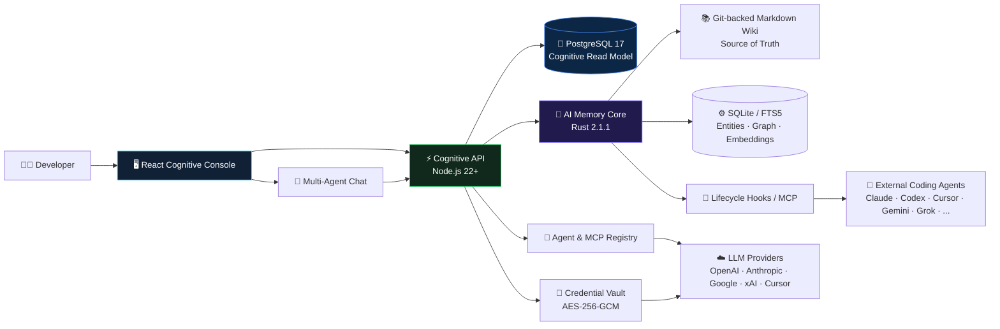

---

# 🧠 Princípio arquitetural central

A arquitetura separa quatro conceitos que normalmente ficam acoplados em aplicações de chat:

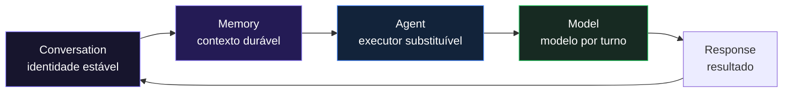

**A conversa não pertence ao GPT, Claude ou qualquer outro provedor.**  
O agente/modelo é apenas o executor daquele turno.

Isso permite:

- trocar de agente durante a mesma conversa;
- trocar de modelo sem recriar contexto;
- recuperar decisões antigas do projeto;
- carregar contexto de outras conversas relevantes;
- anexar ZIPs de código;
- capturar a resposta novamente no AI Memory Core;
- manter continuidade mesmo quando o executor muda.

---

# 🔄 Ciclo completo da memória

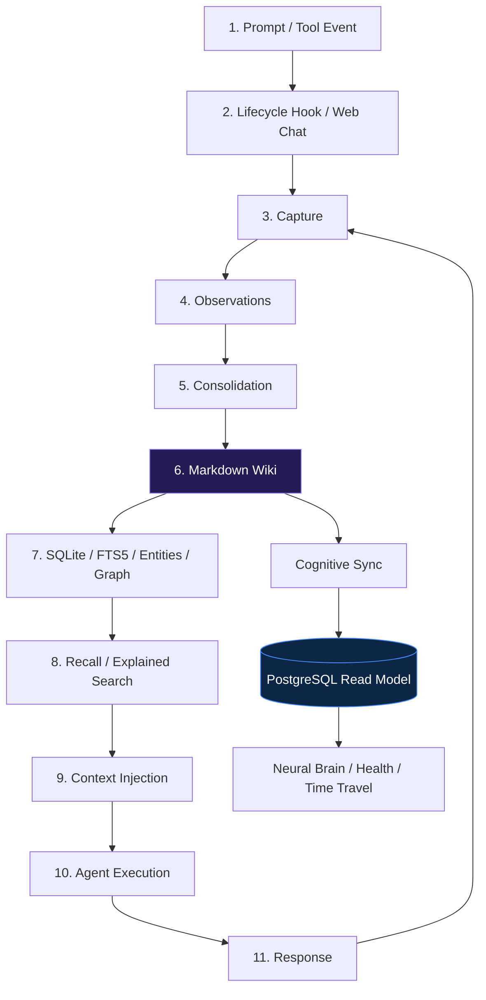

O **Markdown Wiki continua sendo a fonte de verdade**.  
SQLite e PostgreSQL são índices/read-models derivados e podem ser reconstruídos.

---

# 💬 Web Chat multiagente

O frontend possui um chat persistente lado a lado com o Cognitive Console.

Cada turno pode utilizar um agente e modelo diferentes sem perder a identidade da conversa.

## Contexto montado por turno

O backend combina:

```text
Recent conversation history
        +
Relevant old messages from the same/project conversations
        +
Consolidated AI Memory pages
        +
ZIP attachment textual context
        ↓
System context
        ↓
Selected Agent / Model
```

## Sequência de execução

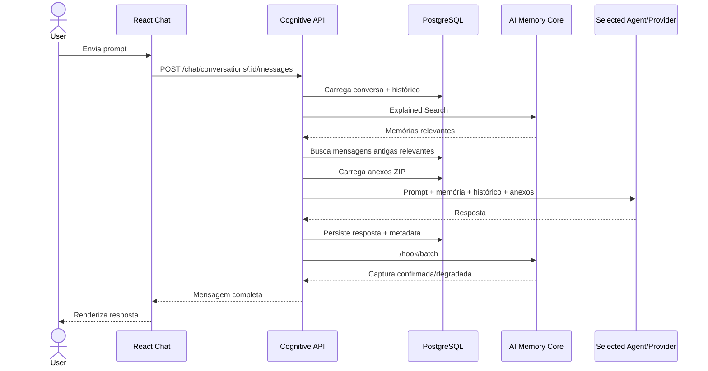

---

# 🕸️ Neural Brain

O **Neural Brain** representa visualmente a memória compartilhada entre agentes.

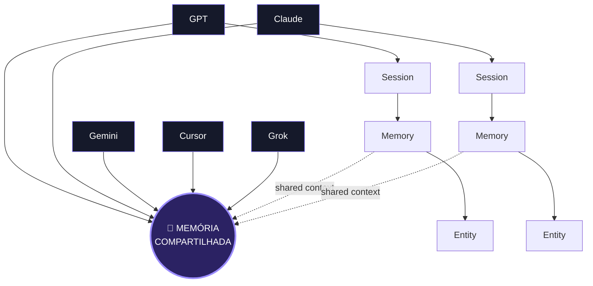

### Tipos de nós

| Nó | Significado |
|---|---|
| `AGENT` | Agente que produziu ou consumiu contexto |
| `SESSION` | Sessão observada pelo Core |
| `MEMORY` | Página consolidada de conhecimento |
| `ENTITY` | Entidade extraída da memória |
| `EXTERNAL` | Relação com memória fora do projeto atual |

### Tipos de relações

| Relação | Significado |
|---|---|
| `produced-session` | Agente originou uma sessão |
| `produced-memory` | Sessão/agente produziu uma memória |
| `entity` | Memória referencia uma entidade |
| relações tipadas do Core | Links entre páginas, inclusive cross-project |

---

# 📊 Cognitive Read Model

O PostgreSQL foi adicionado para responder perguntas que o frontend precisa fazer com baixa latência e boa rastreabilidade.

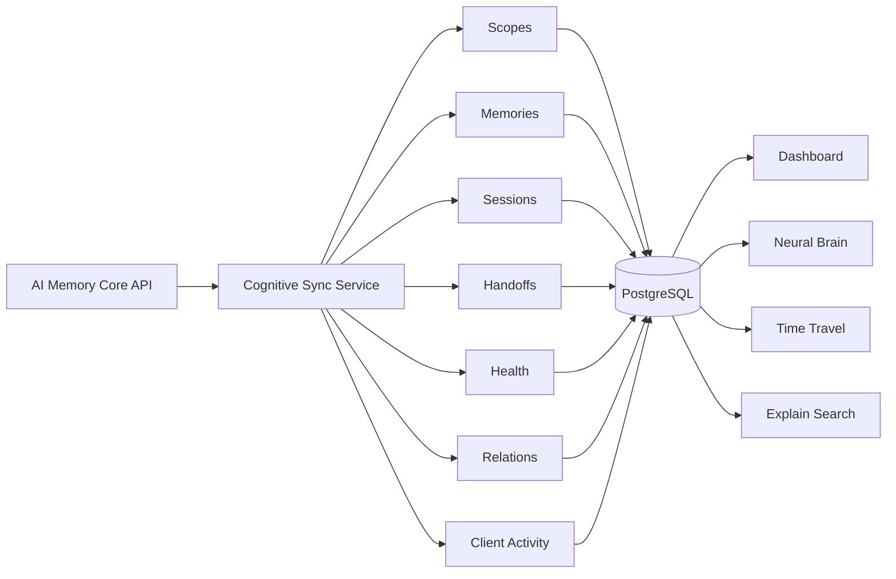

O sync é iniciado automaticamente após o startup e se repete conforme:

```text
COGNITIVE_SYNC_INTERVAL_MS=30000
```

A concorrência de sincronização de páginas é controlada por:

```text
COGNITIVE_SYNC_PAGE_CONCURRENCY=8
```

---

# 📈 Indicadores de observabilidade

O console expõe uma visão operacional da qualidade da memória.

| Indicador | O que responde |
|---|---|
| **Memórias** | Quantas páginas cognitivas existem no projeto |
| **Provenance** | Quantas memórias possuem ligação rastreável com sessão/agente |
| **Sessões** | Quantas sessões foram observadas e quantas observações produziram |
| **Contradições** | Quantas memórias foram identificadas como contraditórias |
| **Handoffs** | Quantas transferências de contexto existem e quantas continuam abertas |
| **Último Sync** | Estado da última materialização do Core para o read-model |
| **Stale** | Memórias potencialmente desatualizadas |
| **Duplicate** | Memórias possivelmente duplicadas |
| **Orphan** | Memórias sem relações adequadas |
| **Retrieval traces** | Como e por que uma memória apareceu em uma busca |

---

# 🔎 Explainable Retrieval

A busca explicável combina sinais do Core e persiste traces no PostgreSQL.

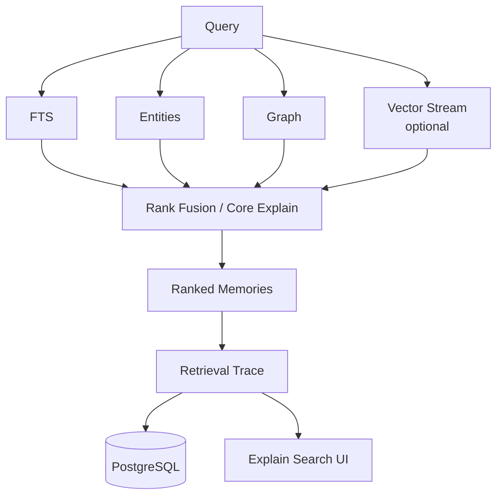

O stream vetorial é opcional. Sem embeddings externos, FTS, entidades e grafo continuam disponíveis.

---

# 🧩 Módulos do Frontend

| Módulo | Objetivo |
|---|---|
| **Neural Brain** | Visualizar agentes, sessões, memórias, entidades e relações |
| **Memory Health** | Encontrar stale, duplicadas, órfãs e contradições |
| **Configurar Agentes** | Agentes, MCPs, credenciais, providers, modelos e bindings |
| **Activity & Handoffs** | Atividade recente e transferência de contexto entre agentes |
| **Time Travel** | Histórico imutável das versões de uma memória |
| **Explain Search** | Entender por que determinada memória foi recuperada |
| **Persistent Web Chat** | Conversa independente do agente, com memória compartilhada e ZIPs |
| **Optimization** | Recomendações para corrigir memória degradada |

---

# 🤖 Agent & MCP Registry

A plataforma possui um registry operacional separado do Core.

Um agente pode ser configurado como:

| Tipo | Uso |
|---|---|
| `api-key` | Execução direta via API de provider |
| `mcp` | Agente conectado por MCP |
| `hybrid` | Combinação de API e MCP |
| `external` | Integração externa sem execução direta pelo Web Chat |

### MCP transports

- Streamable HTTP
- SSE
- stdio

Um agente pode estar ligado a múltiplos MCPs.

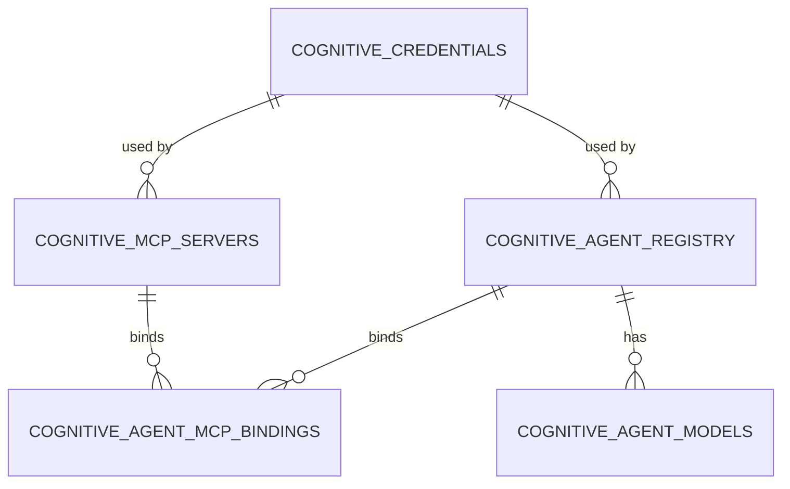

---

# 🧠 Agentes default

A migration `003_chat_and_default_agents.sql` cria cinco agentes default.  
Depois do bootstrap, basta associar as credenciais necessárias.

| Agente | Provider | Modelo default | Adapter |
|---|---|---|---|
| **GPT** | OpenAI | `gpt-6-astra` | `openai-responses` |
| **Claude** | Anthropic | `claude-sonnet-5` | `anthropic-messages` |
| **Gemini** | Google Gemini | `gemini-3.8-flash` | `gemini-generate-content` |
| **Cursor** | Cursor | `composer-2` | `cursor-cloud` |
| **Grok** | xAI | `grok-4.6` | `xai-responses` |

A mesma migration cadastra **19 modelos** no catálogo inicial.

> Os identificadores são seeds de configuração da plataforma. A disponibilidade real de cada modelo depende da conta, região e API do provider configurado no momento da execução.

---

# 🔐 Credential Vault

Credenciais não são armazenadas em plaintext.

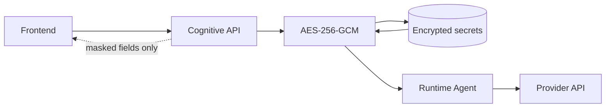

### Regras

- criptografia AES-256-GCM;
- chave mestra via `COGNITIVE_CREDENTIALS_MASTER_KEY_BASE64`;
- valores secretos não são retornados novamente ao frontend;
- frontend recebe apenas metadados/valores mascarados;
- rotação de credencial sem exposição do plaintext anterior;
- credencial não pode ser removida enquanto estiver em uso por agente ou MCP.

O `script/run-local.sh` do backend gera automaticamente uma chave local de 32 bytes caso ela ainda não exista.

---

# 📦 ZIP attachments

O Web Chat suporta anexar projetos `.zip` e exportar uma conversa completa.

### Proteções implementadas

- limite de tamanho do ZIP;
- limite de quantidade de entradas;
- limite de tamanho descompactado;
- bloqueio de path traversal;
- bloqueio de symbolic links;
- bloqueio de ZIP criptografado;
- bloqueio de ZIP64;
- leitura contextual apenas de arquivos textuais suportados;
- exclusão de diretórios pesados como `node_modules`, `target`, `dist`, `.git`;
- `.env` e `.env.*` não entram no contexto enviado aos modelos;
- SHA-256 persistido para cada anexo.

### Defaults

| Variável | Default |
|---|---:|
| `COGNITIVE_CHAT_ATTACHMENT_MAX_BYTES` | 50 MiB |
| `COGNITIVE_CHAT_ZIP_MAX_ENTRIES` | 800 |
| `COGNITIVE_CHAT_ZIP_MAX_UNCOMPRESSED_BYTES` | 150 MiB |
| `COGNITIVE_CHAT_ATTACHMENT_CONTEXT_MAX_BYTES` | 384 KiB |
| `COGNITIVE_CHAT_HISTORY_LIMIT` | 24 mensagens |
| `COGNITIVE_CHAT_MEMORY_RECALL_LIMIT` | 6 memórias |

---

# 🗃️ Persistência

Existem **três camadas de persistência com responsabilidades diferentes**.

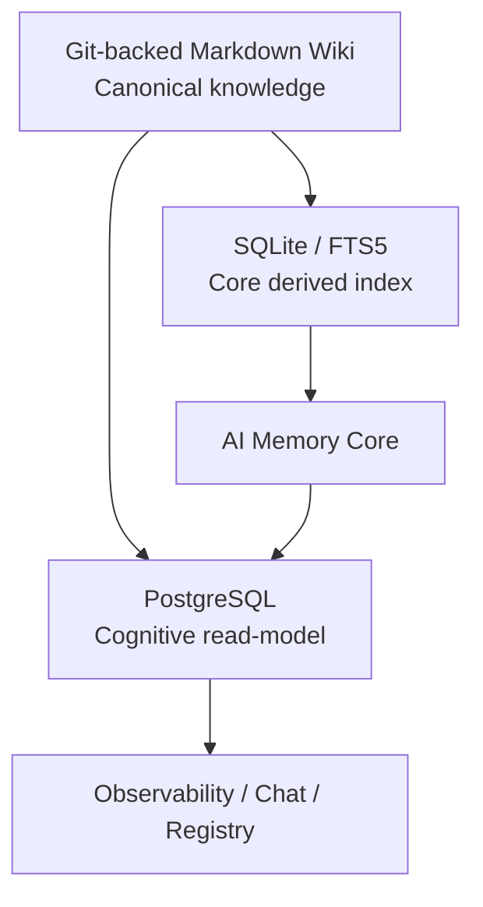

## 1. Markdown Wiki

Fonte de verdade da memória consolidada.

- arquivos `.md`;
- versionamento Git;
- editável por ferramentas comuns;
- portável;
- independente de banco vetorial.

## 2. SQLite

Índice interno do Core.

- FTS5;
- entidades;
- relações;
- embeddings opcionais;
- operações do runtime do `ai-memory`.

## 3. PostgreSQL

Read-model e estado operacional da Cognitive Platform.

### Tabelas cognitivas

```text
cognitive_scopes
cognitive_memories
cognitive_memory_versions
cognitive_relations
cognitive_sessions
cognitive_handoffs
cognitive_health_snapshots
cognitive_client_activity
cognitive_retrieval_traces
cognitive_sync_runs
```

### Registry e segurança

```text
cognitive_credentials
cognitive_mcp_servers
cognitive_agent_registry
cognitive_agent_mcp_bindings
cognitive_integration_audit
cognitive_agent_models
```

### Web Chat

```text
cognitive_chat_conversations
cognitive_chat_messages
cognitive_chat_attachments
cognitive_chat_agent_state
```

Total atual: **20 tabelas PostgreSQL** distribuídas em três migrations.

---

# 🗺️ Modelo de dados simplificado

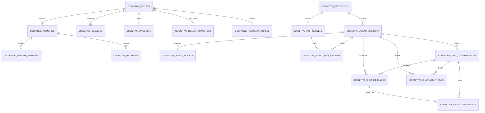

---

# ⚙️ Stack tecnológica

## Backend

| Camada | Tecnologia |
|---|---|
| Core de memória | Rust 1.95+, Edition 2024 |
| Core version | `2.1.1` |
| Async | Tokio |
| HTTP Core | Axum |
| MCP | `rmcp` |
| Core storage | SQLite + FTS5 |
| Wiki | Markdown + Git (`git2`) |
| LLM HTTP | Reqwest |
| Cognitive API | Node.js 22+ |
| Cognitive API HTTP | `node:http` nativo |
| PostgreSQL client | `pg 8.23` |
| Cognitive DB | PostgreSQL 17 |
| Containers | Docker / Docker Compose |

## Frontend

| Camada | Tecnologia |
|---|---|
| UI | React 19.3 |
| Bundler/dev server | Vite 8.2 |
| Styling | CSS próprio |
| API | Fetch API |
| Build | Vite |
| Deploy container | Nginx |

---

# 📁 Estrutura dos dois projetos

## Backend

```text
ai-memory-backend/
├── crates/
│   ├── ai-memory-core/
│   ├── ai-memory-store/
│   ├── ai-memory-wiki/
│   ├── ai-memory-mcp/
│   ├── ai-memory-hooks/
│   ├── ai-memory-llm/
│   ├── ai-memory-consolidate/
│   ├── ai-memory-web/
│   ├── ai-memory-cli/
│   └── ai-memory-workstream/
├── services/
│   └── cognitive-api/
│       └── src/
│           ├── attachment-service.js
│           ├── chat-repository.js
│           ├── chat-service.js
│           ├── config.js
│           ├── core-client.js
│           ├── credential-vault.js
│           ├── embedding-client.js
│           ├── integration-repository.js
│           ├── integration-service.js
│           ├── llm-executor.js
│           ├── repository.js
│           ├── server.js
│           └── sync-service.js
├── db/
│   └── migrations/
│       ├── 001_cognitive_console.sql
│       ├── 002_agent_registry.sql
│       └── 003_chat_and_default_agents.sql
├── hooks/
├── docs/
├── docker/
├── script/
│   └── run-local.sh
└── Cargo.toml
```

## Frontend

```text
ai-memory-frontend/
├── src/
│   ├── components/
│   │   ├── ActivityFeed.jsx
│   │   ├── AgentEditor.jsx
│   │   ├── BrainGraph.jsx
│   │   ├── ChatWorkspace.jsx
│   │   ├── CredentialEditor.jsx
│   │   ├── EvolutionPanel.jsx
│   │   ├── HandoffFlow.jsx
│   │   ├── IntegrationHub.jsx
│   │   ├── McpEditor.jsx
│   │   ├── MemoryDrawer.jsx
│   │   ├── MessageContent.jsx
│   │   ├── MetricCard.jsx
│   │   ├── OptimizationPanel.jsx
│   │   └── SearchExplain.jsx
│   ├── lib/
│   │   └── api.js
│   ├── App.jsx
│   ├── main.jsx
│   └── styles.css
├── script/
│   └── run-local.sh
├── Dockerfile
├── nginx.conf
├── package.json
└── vite.config.js
```

---

# 🚀 Quick Start

## Pré-requisitos

- Docker Engine ou Docker Desktop
- Docker Compose v2
- Node.js 22+
- npm
- Linux/macOS ou ambiente compatível com Docker

---

## 1. Subir o backend

No repositório backend:

```bash
./script/run-local.sh
```

Na primeira execução o script:

1. cria `docker/.env` a partir de `docker/cognitive.env.example`;
2. gera a chave mestra do Credential Vault se estiver vazia;
3. valida Docker e Compose;
4. builda os containers;
5. sobe Core, PostgreSQL e Cognitive API;
6. aguarda healthchecks.

Serviços locais:

| Serviço | URL |
|---|---|
| AI Memory Core | `http://127.0.0.1:49374` |
| Cognitive API | `http://127.0.0.1:8787` |
| Health | `http://127.0.0.1:8787/healthz` |

Containers:

```text
ai-memory
ai-memory-cognitive-db
ai-memory-cognitive-api
```

---

## 2. Subir o frontend

No repositório frontend:

```bash
./script/run-local.sh
```

URL default:

```text
http://127.0.0.1:5173
```

O backend default é:

```text
http://127.0.0.1:8787
```

Para apontar para outro ambiente:

```bash
COGNITIVE_API_URL=https://ai-memory-api.exemplo.com ./script/run-local.sh
```

O Vite faz proxy de:

```text
/api     -> Cognitive API
/healthz -> Cognitive API
```

---

# 🐳 Topologia Docker local

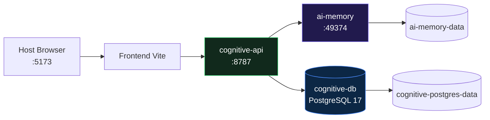

O PostgreSQL não é publicado diretamente no host no Compose padrão.

---

# 🔧 Configuração do backend

Arquivo local:

```text
docker/.env
```

Base:

```text
docker/cognitive.env.example
```

### Core

| Variável | Default / finalidade |
|---|---|
| `AI_MEMORY_PORT` | `49374` |
| `AI_MEMORY_AUTH_TOKEN` | Bearer token opcional do Core |
| `AI_MEMORY_ALLOWED_HOSTS` | Hosts aceitos pelo Core |

### PostgreSQL / Cognitive API

| Variável | Default / finalidade |
|---|---|
| `COGNITIVE_DB_NAME` | `ai_memory` |
| `COGNITIVE_DB_USER` | `ai_memory` |
| `COGNITIVE_DB_PASSWORD` | senha local |
| `COGNITIVE_API_PORT` | `8787` |
| `COGNITIVE_ADMIN_TOKEN` | protege operações mutáveis |
| `CORS_ORIGIN` | `*` em local |

### Sync

| Variável | Default |
|---|---:|
| `COGNITIVE_SYNC_ENABLED` | `true` |
| `COGNITIVE_SYNC_INTERVAL_MS` | `30000` |
| `COGNITIVE_SYNC_PAGE_CONCURRENCY` | `8` |
| `COGNITIVE_BRAIN_NODE_LIMIT` | `320` |

### Embeddings opcionais

```text
COGNITIVE_EMBEDDING_BASE_URL=
COGNITIVE_EMBEDDING_API_KEY=
COGNITIVE_EMBEDDING_PROVIDER=
COGNITIVE_EMBEDDING_MODEL=
COGNITIVE_EMBEDDING_DIM=0
```

### Credential Vault

```text
COGNITIVE_CREDENTIALS_MASTER_KEY_BASE64=
```

Em ambiente local, `run-local.sh` gera a chave automaticamente caso necessário.

---

# 🔌 API principal

Base local:

```text
http://127.0.0.1:8787
```

## Health

```http
GET /healthz
```

## Cognitive Console

```http
GET  /api/v1/cognitive/scopes
GET  /api/v1/cognitive/summary
GET  /api/v1/cognitive/brain
GET  /api/v1/cognitive/health
GET  /api/v1/cognitive/agents
GET  /api/v1/cognitive/handoffs
GET  /api/v1/cognitive/activity
GET  /api/v1/cognitive/memories
GET  /api/v1/cognitive/memory
GET  /api/v1/cognitive/evolution
GET  /api/v1/cognitive/optimization
GET  /api/v1/cognitive/retrieval-traces
GET  /api/v1/cognitive/sync/status

POST /api/v1/cognitive/search/explain
POST /api/v1/cognitive/sync
```

## Agent / MCP configuration

```http
GET    /api/v1/cognitive/integrations/summary

GET    /api/v1/cognitive/config/agents
POST   /api/v1/cognitive/config/agents
PUT    /api/v1/cognitive/config/agents/:id
PATCH  /api/v1/cognitive/config/agents/:id/status
DELETE /api/v1/cognitive/config/agents/:id

GET    /api/v1/cognitive/config/models

GET    /api/v1/cognitive/config/mcps
POST   /api/v1/cognitive/config/mcps
PUT    /api/v1/cognitive/config/mcps/:id
PATCH  /api/v1/cognitive/config/mcps/:id/status
DELETE /api/v1/cognitive/config/mcps/:id

GET    /api/v1/cognitive/config/credentials
POST   /api/v1/cognitive/config/credentials
PUT    /api/v1/cognitive/config/credentials/:id
DELETE /api/v1/cognitive/config/credentials/:id

GET    /api/v1/cognitive/config/audit
```

## Web Chat

```http
GET    /api/v1/cognitive/chat/bootstrap
POST   /api/v1/cognitive/chat/conversations
GET    /api/v1/cognitive/chat/conversations/:id
PATCH  /api/v1/cognitive/chat/conversations/:id
DELETE /api/v1/cognitive/chat/conversations/:id

POST   /api/v1/cognitive/chat/conversations/:id/messages
POST   /api/v1/cognitive/chat/conversations/:id/attachments
GET    /api/v1/cognitive/chat/conversations/:id/export
GET    /api/v1/cognitive/chat/attachments/:id/download
```

---

# 🔁 Sincronização manual

Sem `COGNITIVE_ADMIN_TOKEN`:

```bash
curl -X POST http://127.0.0.1:8787/api/v1/cognitive/sync \
  -H 'Content-Type: application/json' \
  -d '{"workspace":"default","project":"my-project"}'
```

Com token administrativo:

```bash
curl -X POST http://127.0.0.1:8787/api/v1/cognitive/sync \
  -H 'Content-Type: application/json' \
  -H 'X-Admin-Token: SEU_TOKEN' \
  -d '{"workspace":"default","project":"my-project"}'
```

---

# 🧪 Comandos de desenvolvimento

## Backend Cognitive API

```bash
cd services/cognitive-api
npm install
npm run check
npm start
```

## Core Rust

```bash
cargo build
cargo test
```

## Frontend

```bash
npm install
npm run dev
npm run build
npm run preview
```

---

# 🛡️ Segurança

A plataforma aplica segurança em múltiplas fronteiras.

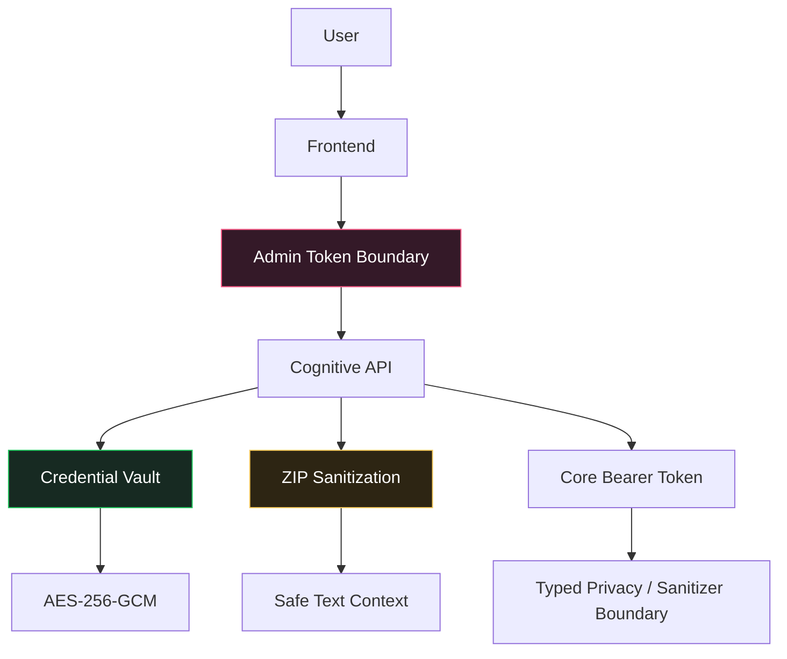

### Controles existentes

- bearer token opcional entre Cognitive API e Core;
- `COGNITIVE_ADMIN_TOKEN` para mutações sensíveis;
- AES-256-GCM para credenciais;
- segredos mascarados no frontend;
- sem recuperação de plaintext;
- validação de URLs e tipos de integração;
- validação de MCP transport;
- limites de body HTTP;
- validação defensiva de ZIP;
- exclusão de `.env` do contexto;
- CORS configurável;
- PostgreSQL privado no Compose local;
- audit trail para integrações.

> Para produção, não use `CORS_ORIGIN=*`, defina tokens fortes e gerencie a chave mestra fora do repositório.

---

# 🧭 Fluxo de handoff

Handoff não é apenas texto informal: é um objeto rastreável de transferência de contexto.

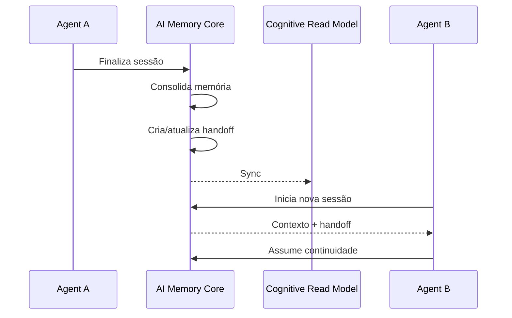

O Cognitive Console exibe:

- origem;
- destino/estado;
- resumo;
- perguntas abertas;
- próximos passos;
- arquivos tocados;
- owner;
- aceite.

---

# ⏱️ Time Travel

`cognitive_memory_versions` é append-only por:

```text
(workspace, project, path, source_updated_at)
```

Isso permite inspecionar a evolução de uma memória sem alterar o histórico do Core.

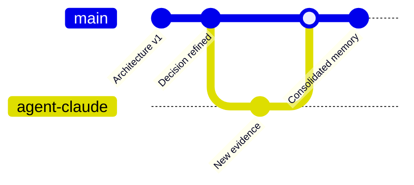

---

# 🧹 Memory Health & Optimization

A plataforma separa diagnóstico de memória de execução dos agentes.

### Prioridades

```text
contradiction -> critical
stale         -> high
duplicate     -> high
orphan        -> medium
no provenance -> medium
```

### Ações sugeridas

```text
resolve-contradiction
refresh-stale-memory
merge-duplicate-memory
link-or-remove-orphan
add-provenance
review
```

---

# 🧱 Invariantes de arquitetura

Estes princípios devem ser preservados em qualquer evolução:

1. **O agente é substituível; a memória não é.**
2. **O Core continua sendo a fonte de verdade.**
3. **Markdown permanece portável e inspecionável.**
4. **PostgreSQL é read-model/estado operacional, não substituto do Wiki.**
5. **Uma conversa mantém identidade própria independentemente do provider.**
6. **Segredos nunca retornam em plaintext pela API.**
7. **Falha de memória consolidada não deve destruir o histórico do chat.**
8. **Dados recuperados e anexos são contexto não confiável, nunca instruções de maior prioridade.**
9. **Observabilidade precisa explicar origem, evolução e recuperação da memória.**
10. **Frontend e backend continuam implantáveis independentemente.**

---

# 🎯 Estado atual da plataforma

```text
Shared Memory Core          ████████████████████  ✓
Cross-Agent Continuity      ████████████████████  ✓
Cognitive Read Model        ████████████████████  ✓
Neural Brain                ████████████████████  ✓
Memory Health               ████████████████████  ✓
Agent Registry              ████████████████████  ✓
MCP Registry                ████████████████████  ✓
Credential Vault            ████████████████████  ✓
Multi-Agent Web Chat        ████████████████████  ✓
ZIP Context / Export        ████████████████████  ✓
Explain Search              ████████████████████  ✓
Time Travel                 ████████████████████  ✓
Live Token Streaming        ███████░░░░░░░░░░░░░  next
Realtime Neural Events      █████░░░░░░░░░░░░░░░  next
Automatic Agent Routing     ████░░░░░░░░░░░░░░░░  future
```

---

# 🚀 Roadmap técnico recomendado

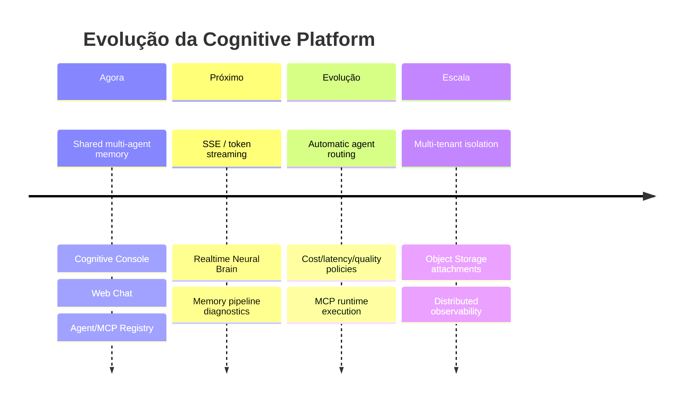

### Próximos movimentos de maior impacto

- **SSE/WebSocket** para streaming real de tokens e eventos cognitivos;
- visualizar `Recall → Agent → Tool/MCP → Response → Capture` em tempo real;
- mostrar estados `captured → consolidating → indexed → retrievable`;
- roteamento automático de agente/modelo por custo, latência e qualidade;
- métricas de reutilização: quem criou a memória vs. quem realmente a consumiu;
- object storage para anexos;
- quotas e retenção;
- antivírus/AV scanning para uploads;
- RBAC e isolamento multi-tenant;
- OpenTelemetry para traces end-to-end;
- dashboard de custos por agente/modelo.

---

# 🤝 Relação com o projeto original

O backend mantém e estende o projeto open source **ai-memory**, de Fabio Akita / AkitaOnRails.

Projeto upstream:

```text
https://github.com/akitaonrails/ai-memory
```

O núcleo de memória, Wiki Markdown, hooks, MCP, consolidação e mecanismos centrais continuam sob a arquitetura do Core original.  
A **Cognitive Platform** adiciona a camada de produto: visualização, read-model PostgreSQL, registry, credenciais, Web Chat e observabilidade cognitiva.

Consulte também no backend:

```text
README.md
docs/ARCHITECTURE.md
docs/cognitive-console.md
docs/security.md
docs/deploy.md
```

---

# 📄 Licença

O AI Memory Core presente no backend declara licença **MIT**.  
Antes de distribuir uma versão derivada da plataforma, preserve os avisos de copyright e confirme a licença aplicável aos componentes adicionados pelo seu projeto.

---

<div align="center">

## 🧠 AI Memory

### O agente pode mudar. A memória do trabalho continua.

**Build once. Remember forever. Execute with any agent.**

</div>
